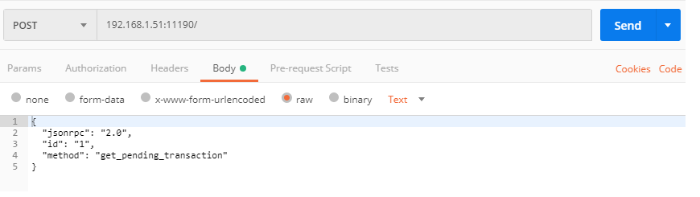
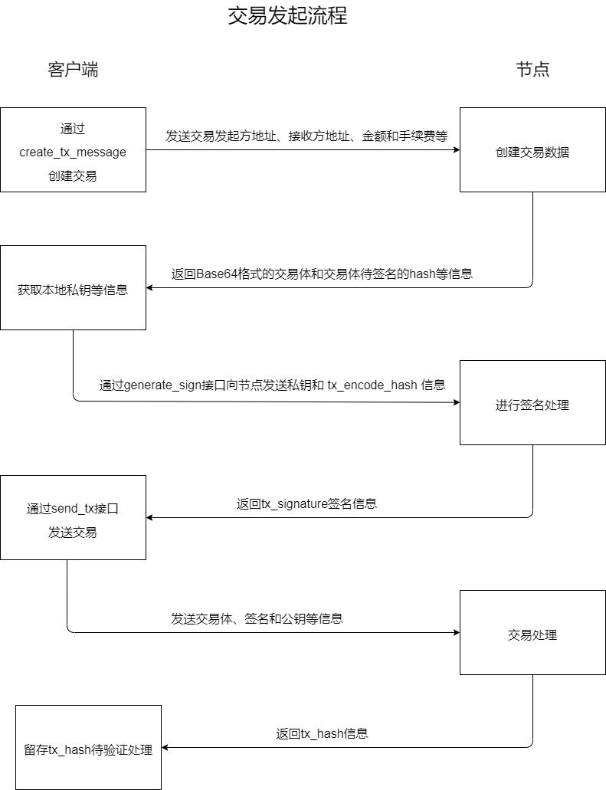
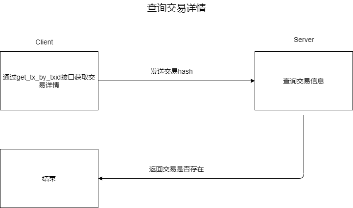

## jsonrpc接口文档
---------------------------

说明：jsonrpc标准为2.0，文档中的数据皆为测试数据，请求方式为 POST
默认端口为11190，可以在配置文件config.json中"http_port"属性中指定端口值
可使用HTTP工具Postman或者Curl进行访问测试
#### Postman示例
```

Postman：新建"Request", 选择"POST",输入URL地址，需包含端口号11190（如：192.168.1.51:11190/）；
选择Body,选择Raw选项，输入json请求内容，如{ "jsonrpc": "2.0", "method": "get_height", "id": "1" },
填写完毕后，点击"Send"按钮，服务端响应请求并发回响应内容。
```

#### Curl示例
```
Curl: curl -i -X POST -H "Content-Type: application/json; indent=4" -d '{ "jsonrpc": "2.0", "method": "get_height", "id": "1" }' 192.168.1.51:11190
输入上面内容，即可访问get_height接口
```


### 一、获取高度（get_height）

#### 请求
```
{
  "jsonrpc": "2.0",
  "id": "1",
  "method": "get_height"
}
```

#### 返回值

```
成功返回：
{
  "jsonrpc": "2.0",
  "id": "1",
  "result": {
    "height": "100"
  }
}
失败返回：
{
    "error": {
        "code": -32601,
        "message": "Method not found"
    },
    "id": "",
    "jsonrpc": "2.0"
}
```

#### 字段说明
```
请求：
jsonrpc  字符串类型 2.0标准 (相同字段以下不再重复)
id		 字符串类型 编号，客户端发送什么，服务端回复相同的编号 (相同字段以下不再重复)
method	 字符串类型 调用的方法名 (相同字段以下不再重复)
响应：
result   json对象  调用成功返回的结果信息 (相同字段以下不再重复)
height 	 字符串类型 区块高度
error    json对象  调用出错返回的结果信息 (相同字段以下不再重复)
code     整型  	 错误码 (相同字段以下不再重复)
message  字符串类型 错误描述 (相同字段以下不再重复)
```

#### 示例
```
curl -i -X POST -H "Content-Type: application/json; indent=4" -d '{"jsonrpc": "2.0", "method": "get_height", "id": "1" }' 192.168.1.51:11190
```


### 二、通过高度获取所有交易hash  (get_txids_by_height)

#### 请求
```
{
  "jsonrpc": "2.0",
  "id": "1",
  "method": "get_txids_by_height",
  "params": {
    "height": "1"
  }
}
```

#### 返回值
```
成功返回：
{
    "id": "1",
    "jsonrpc": "2.0",
    "result": [
        "772298b54a30e8b9e51b677a497369e19c3bc8ad500bf418b968638fd5d2960f",
        "6916d3a37128df383326249abfd57fec11fe693ca1b802bb0e0a9293a688c520",
        "7744719b0014bf6f733b9a0624a78273e0cf90818dd5fb02b623a0229990cebb"
    ]
}
失败返回：
{
    "error": {
        "code": -32602,
        "message": "Invalid params"
    },
    "id": "1",
    "jsonrpc": "2.0"
}
```

#### 字段说明
```
请求：
params   json对象		方法所需要的参数(相同字段以下不再重复)
height 	 字符串类型    区块高度
响应：
result   json数组     当前区块高度所有交易hash组成的json数组
```

#### 示例
```
curl -i -X POST -H "Content-Type: application/json; indent=4" -d '{"jsonrpc": "2.0", "method": "get_txids_by_height", "params": {"height": "1"} }' 192.168.1.51:11190
```


### 三、根据地址获取余额（get_balance）

#### 请求
``` 
{
  "jsonrpc": "2.0",
  "id": "1",
  "method": "get_balance",
  "params": {
    "address": "1BuFpDmH2bJhqxQoyv8cC8YL3mU2TnUDES"
  }
}
```

#### 返回值
```
成功返回：
{
    "id": "1",
    "jsonrpc": "2.0",
    "result": {
        "balance": "888.666668"
    }
}
失败返回：
{
    "error": {
        "code": -32602,
        "message": "Invalid params"
    },
    "id": "1",
    "jsonrpc": "2.0"
}

```

#### 字段说明
```
请求：
address  字符串类型	  钱包地址
响应：
balance  字符串类型	  钱包余额
```

#### 示例
```
curl -i -X POST -H "Content-Type: application/json; indent=4" -d '{"jsonrpc": "2.0", "id": "1", "method": "get_balance", "params": { "address":"1BuFpDmH2bJhqxQoyv8cC8YL3mU2TnUDES" } }' 192.168.1.51:11190
```


### 四、根据交易hash获取交易详情  (get_tx_by_txid)

#### 请求
``` 
{
  "jsonrpc": "2.0",
  "id": "1",
  "method": "get_tx_by_txid",
  "params": {
    "hash": "3bb0c305a59c45a35eb48fef3ac5a9f42104a083288b867572fa07b9a7961baa"
  }
}
```


#### 返回值
```
成功返回：
{
    "id": "1",
    "jsonrpc": "2.0",
    "result": {
        "hash": "3bb0c305a59c45a35eb48fef3ac5a9f42104a083288b867572fa07b9a7961baa",
        "time": 1603854991179495,
        "type": "tx"
        "height": ""
        "vin": [
            {
                "address": "1BuFpDmH2bJhqxQoyv8cC8YL3mU2TnUDES",
                "output_index": 0,
                "output_value": "1000.000000",
                "prev_hash": "4df2ac157683a5553503731aa74495c556f46faf11c595b95ee5980f8b5013b0"
            }
        ],
        "vout": [
            {
                "address": "1FoQKZdUNeBXV2nTba6e354m5JrQ4rHYgA",
                "value": "10.000000"
            },
            {
                "address": "1BuFpDmH2bJhqxQoyv8cC8YL3mU2TnUDES",
                "value": "989.000000"
            }
        ]
    }
}


失败返回：
没有查找到该笔交易返回：
{
    "error": {
        "code": -32000,
        "message": "not find"
    },
    "id": "1",
    "jsonrpc": "2.0"
}

参数错误返回：
{
    "error": {
        "code": -32602,
        "message": "Invalid params"
    },
    "id": "1",
    "jsonrpc": "2.0"
}
```

#### 字段说明
```
请求：
hash  			字符串类型		 	交易hash
响应：
hash  			字符串类型		 	交易hash
time  			无符号64位整型   		时间戳

type			字符串类型			交易的类型,有三种类型,只需要处理正常交易类型：    "tx"		  	正常交易
													  	  					"pledge"  		质押交易
													  	  					"redeem" 		解质押交易
height			字符串类型			当前交易所在区块高度
vin   			json数组		  	  交易输入
address 		字符串类型			交易转出地址
prev_hash		字符串类型			utxo所在的交易hash
output_index	整型				  索引
output_value	字符串类型			utxo金额

vout  			json数组		      交易转入地址和金额组成的json对象
address 		字符串类型		    交易转入地址
value 			字符串类型		    交易金额 

实际花费的fee计算：vin里的output_value 减去 vout 里的所有value
```

#### 示例
```
curl -i -X POST -H "Content-Type: application/json; indent=4" -d '{"jsonrpc": "2.0", "id": "1", "method": "get_tx_by_txid", "params": { "hash": "3bb0c305a59c45a35eb48fef3ac5a9f42104a083288b867572fa07b9a7961baa" } }' 192.168.1.51:11190
```


### 五、创建交易体  (create_tx_message)

#### 请求
```
{
    "jsonrpc": "2.0",
    "id": "1",
    "method": "create_tx_message",
    "params": {
        "from_addr": ["1BuFpDmH2bJhqxQoyv8cC8YL3mU2TnUDES"],
        "to_addr": [{"addr": "1FoQKZdUNeBXV2nTba6e354m5JrQ4rHYgA", "value": "22.222222"}],
        "fee": "0.555555"
    }
}
```

#### 返回值
```
成功返回：
{
    "id": "1",
    "jsonrpc": "2.0",
    "result": {
        "tx_data": "EM2nvbfKuOwCIiIxQnVGcERtSDJiSmhxeFFveXY4Y0M4WUwzbVUyVG5VREVTMig4ZjU1M2U5ODA4MzM4MjZhMDIxYWQ5MTU4MDA5N2E5OGVkY2EzM2M3QkQKQgpAMDEwZDJmYTBkNzkwNDEzNDlmM2QwZWFmY2FjMzg5ZTQ4NTM1MzgyYzE1M2VmYzNiYWZlZjFjMTcyNjU5ZjU2YUopCI6rzAoSIjFGb1FLWmRVTmVCWFYyblRiYTZlMzU0bTVKclE0ckhZZ0FKKgjY4M+cAxIiMUJ1RnBEbUgyYkpocXhRb3l2OGNDOFlMM21VMlRuVURFU1JDeyJHYXNGZWUiOjU1NTU1NSwiTmVlZFZlcmlmeVByZUhhc2hDb3VudCI6MywiVHJhbnNhY3Rpb25UeXBlIjoidHgifQ==",
        "tx_encode_hash": "3c9a103d8542750dd048eecf2151b052ed26051f201246089bfc01e508ed7000"
    }
}
失败返回：
创建交易失败返回：
{
    "error": {
        "code": -32000,
        "message": "create fail,error number:-2"
    },
    "id": "1",
    "jsonrpc": "2.0"
}
参数错误返回：
{
    "error": {
        "code": -32602,
        "message": "Invalid params"
    },
    "id": "1",
    "jsonrpc": "2.0"
}
```

#### 字段说明
```
请求：
from_addr       交易转出地址组成
to_addr			addr:交易转入地址 value:交易金额
fee             交易燃料费
响应：
tx_data         交易体(base64编码)
tx_encode_hash  交易体hash(待签名信息)
```

#### 示例
```
curl -i -X POST -H "Content-Type: application/json; indent=4" -d '{"jsonrpc": "2.0", "id": "1", "method": "create_tx_message", "params": { "from_addr": ["1BuFpDmH2bJhqxQoyv8cC8YL3mU2TnUDES"], "to_addr": [{"addr": "1FoQKZdUNeBXV2nTba6e354m5JrQ4rHYgA", "value": "22.222222"}], "fee": "0.555555"} }' 192.168.1.51:11190
```


### 六、发送交易  (send_tx)

#### 请求
```
{
	"jsonrpc": "2.0",
	"id": "1",
	"method": "send_tx",
	"params": {
		"tx_data": "ELvdqOvRuOwCIiIxQnVGcERtSDJiSmhxeFFveXY4Y0M4WUwzbVUyVG5VREVTMig4ZjU1M2U5ODA4MzM4MjZhMDIxYWQ5MTU4MDA5N2E5OGVkY2EzM2M3QkQKQgpAMjRkMjUxMzMxZGFkYjEyMGMyYmYxMDlhZDI2ODllOWNkMDcwYTAyZWJkZWQxNDA1ZTM5MGFlMmVhMDI0YjEzMEopCI6rzAoSIjFGb1FLWmRVTmVCWFYyblRiYTZlMzU0bTVKclE0ckhZZ0FKKgiwua+GAxIiMUJ1RnBEbUgyYkpocXhRb3l2OGNDOFlMM21VMlRuVURFU1JDeyJHYXNGZWUiOjU1NTU1NSwiTmVlZFZlcmlmeVByZUhhc2hDb3VudCI6MywiVHJhbnNhY3Rpb25UeXBlIjoidHgifQ==",
		"tx_signature": "N1ii0dikr0NJRvi7GXkjXOayD+mVcMfXF+49iOmOneYqYj2HHYzNm3Txj/otW/K7Dh3uBJ2Gb4nlTJW2AY3Dog==",
		"public_key": "ICBszM0aHCpWmDdEC3GMBL6DFN7XdWzijF33uvmWKMa1WbvWBk33+G9E4pSztJWlwDkvEt4dW4oGY8/sY2FJBtPG",
		"tx_encode_hash": "b3b8f15852efddbdfe8aa759a2f026488350b6f56a4cae7494ea3cbba0f8a5c5"
	}
}
```
#### 返回值
```
成功返回：
{
    "id": "1",
    "jsonrpc": "2.0",
    "result": {
        "tx_hash": "e241d6af1b8f8ff58508f14177005b4263d26e32a2e0d0f6b8e98d966cbaa864"
    }
}
失败返回：
验证签名失败返回：
{
    "error": {
        "code": -32000,
        "message": "create fail,error number:-8"
    },
    "id": "1",
    "jsonrpc": "2.0"
}
参数错误返回：
{
    "error": {
        "code": -32602,
        "message": "Invalid params"
    },
    "id": "1",
    "jsonrpc": "2.0"
}
```

#### 字段说明
```
请求：
tx_data         字符串类型		交易体(base64编码),创建交易体方法调用后返回的tx_data
tx_signature    字符串类型		对交易体hash(tx_encode_hash)进行签名得到的签名信息,调用动态库GenSign_()方法进行签名
public_key      字符串类型		公钥(base64编码)
tx_encode_hash	字符串类型		交易体hash(待签名信息),创建交易体方法调用后返回的tx_encode_hash
响应：
tx_hash         字符串类型		交易hash(可通过此hash查询完整交易信息)
```

#### 示例
```
curl -i -X POST -H "Content-Type: application/json; indent=4" -d '{"jsonrpc": "2.0", "id": "1", "method": "send_tx", "params": { "tx_data":"ELvdqOvRuOwCIiIxQnVGcERtSDJiSmhxeFFveXY4Y0M4WUwzbVUyVG5VREVTMig4ZjU1M2U5ODA4MzM4MjZhMDIxYWQ5MTU4MDA5N2E5OGVkY2EzM2M3QkQKQgpAMjRkMjUxMzMxZGFkYjEyMGMyYmYxMDlhZDI2ODllOWNkMDcwYTAyZWJkZWQxNDA1ZTM5MGFlMmVhMDI0YjEzMEopCI6rzAoSIjFGb1FLWmRVTmVCWFYyblRiYTZlMzU0bTVKclE0ckhZZ0FKKgiwua+GAxIiMUJ1RnBEbUgyYkpocXhRb3l2OGNDOFlMM21VMlRuVURFU1JDeyJHYXNGZWUiOjU1NTU1NSwiTmVlZFZlcmlmeVByZUhhc2hDb3VudCI6MywiVHJhbnNhY3Rpb25UeXBlIjoidHgifQ==", "tx_signature": "N1ii0dikr0NJRvi7GXkjXOayD+mVcMfXF+49iOmOneYqYj2HHYzNm3Txj/otW/K7Dh3uBJ2Gb4nlTJW2AY3Dog==", "public_key": "ICBszM0aHCpWmDdEC3GMBL6DFN7XdWzijF33uvmWKMa1WbvWBk33+G9E4pSztJWlwDkvEt4dW4oGY8/sY2FJBtPG", "tx_encode_hash": "b3b8f15852efddbdfe8aa759a2f026488350b6f56a4cae7494ea3cbba0f8a5c5"} }' 192.168.1.51:11190
```


### 七、获取最近100块高度的平均交易燃料费 （get_avg_fee）

说明：fee由矿工自主设置，如果发送交易时设置的fee值低于大多数矿工设置的fee值，可能会造成交易不成功，因此，可以参照最近100个高度的区块平均fee值来设定，确保交易能成功。

#### 请求

```
{
	"jsonrpc": "2.0",
	"id": "1",
	"method": "get_avg_fee"
}
```

#### 返回值

```
成功返回：
{
    "id": "1",
    "jsonrpc": "2.0",
    "result": {
        "avg_fee": "0.112074"
    }
}
失败返回：
{
    "error": {
        "code": -32602,
        "message": "Invalid params"
    },
    "id": "1",
    "jsonrpc": "2.0"
}
```

#### 字段说明

```
响应：
avg_fee         字符串类型		最近100个高度区块fee的平均值,如果高度不足100,则是所有区块的平均值
```

#### 示例
```
curl -i -X POST -H "Content-Type: application/json; indent=4" -d '{"jsonrpc": "2.0", "method": "get_avg_fee", "id": "1" }' 192.168.1.51:11190
```


### 八、生成钱包地址、公钥和私钥（generate_wallet）

#### 请求

``` 
{
  "jsonrpc": "2.0",
  "id": "1",
  "method": "generate_wallet"
}
```

#### 返回值

```
成功返回：
{
    "id": "1",
    "jsonrpc": "2.0",
    "result": {
        "address": "1BGmh7NgY7spKRBHJkwQTZosaHGiXfynvj",
        "private_key": "xAEF+gTQZ6PmtH3hlmygJpAVxBpKHBa3Zw8iMxRjlbQ=",
        "public_key": "ICD6bienPIel1KE4WmGlQ6bC6M+HiPTw3+et036AUaTVtLr1iV1DMFFx2O9VYi/MUXOZyKK87s/GjPE+eN9A+wEl"
    }
}
失败返回：
{
    "error": {
        "code": -32601,
        "message": "Method not found"
    },
    "id": "",
    "jsonrpc": "2.0"
}

```

#### 字段说明

```
响应：
address  	字符串类型	  	钱包地址
private_key 字符串类型 		base64编码后的私钥
public_key  字符串类型 		base64编码后的公钥
```

#### 示例
```
curl -i -X POST -H "Content-Type: application/json; indent=4" -d '{"jsonrpc": "2.0", "method": "generate_wallet", "id": "1" }' 192.168.1.51:11190
```


### 九、生成签名信息（generate_sign）

#### 请求

``` 
{
  "jsonrpc": "2.0",
  "id": "1",
  "method": "generate_sign",
  	"params": {
		"data": "b3b8f15852efddbdfe8aa759a2f026488350b6f56a4cae7494ea3cbba0f8a5c5",
		"private_key": "xAEF+gTQZ6PmtH3hlmygJpAVxBpKHBa3Zw8iMxRjlbQ="
	}
}
```

#### 返回值

```
成功返回：
{
    "id": "1",
    "jsonrpc": "2.0",
    "result": {
        "message": "Ggy2ouJDIZw9/ShvZUwXyVgsAXSFLsxvRCh42elAf+Klit6DJH/jUY6Z3Km/W7VhPKinrsHcaEcwYqIUIwopWQ=="
    }
}
失败返回：
{
    "error": {
        "code": -32602,
        "message": "Invalid params"
    },
    "id": "1",
    "jsonrpc": "2.0"
}

```

#### 字段说明

```
请求：
data			字符串类型		待签名信息, create_tx_message方法调用后返回的tx_encode_hash
private_key		字符串类型		base64编码后的私钥
响应：
message  		字符串类型		base64编码后的已签名信息
```

#### 示例
```
curl -i -X POST -H "Content-Type: application/json; indent=4" -d '{"jsonrpc": "2.0", "method": "generate_sign", "id": "1", "params": { "data": "b3b8f15852efddbdfe8aa759a2f026488350b6f56a4cae7494ea3cbba0f8a5c5", "private_key": "xAEF+gTQZ6PmtH3hlmygJpAVxBpKHBa3Zw8iMxRjlbQ=" } }' 192.168.1.51:11190
```


### 十、查询正在挂起的交易（get_pending_transaction）

#### 请求

``` 
{
  "jsonrpc": "2.0",
  "id": "1",
  "method": "get_pending_transaction",
  	"params": {
		"address": "1MpeeKXwH1ArnMJ85D161yfH1us471J86X"
	}
}
```

#### 返回值

```
成功返回：
{
    "id": "1",
    "jsonrpc": "2.0",
    "result": {
        "total": 1,
        "transaction": [
            {
                "amount": "501",
                "from": [
                    "1MpeeKXwH1ArnMJ85D161yfH1us471J86X"
                ],
                "gap": "0.050000",
                "hash": "4303e57195616797f77d7db888ef15d677740d8f10a9a8e29370d35c3cc853fb",
                "timestamp": 1609313648455902,
                "to": [
                    "1HjrxHbBuuyNQDwKMh4JtqfuGiDCLodEwC"
                ],
                "toAmount": [
                    "501.000000"
                ],
                "vin": [
                    "7d9a0cb698db789b5f294343209b94ca69119f02593cb5607069623810f6ed69",
                    "92c45d62b86d37c04f5f873eedfdcb1719eeca9a43e16b206e98101d20baeb0c",
                    "d2c9da85e7b67188c507f40a95cba88c491afca56b863cce6af512638c7b1b1c"
                ]
            }
        ]
    }
}

```

#### 字段说明

```
请求：
address         字符串类型      交易发起方地址
响应：
total           数值类型        处于挂起的交易的个数
transaction     数组类型        交易内容,包括交易的哈希，发起方，接收方，金额，时间戳
```

#### 示例
```
curl -i -X POST -H "Content-Type: application/json; indent=4" -d '{"jsonrpc": "2.0", "method": "get_pending_transaction", "id": "1", "params": { "address": "1MpeeKXwH1ArnMJ85D161yfH1us471J86X"} }' 192.168.1.51:11190
```


### 十一、查询失败的交易（get_failure_transaction）

#### 请求

``` 
{
  "jsonrpc": "2.0",
  "id": "1",
  "method": "get_failure_transaction",
  	"params": {
		"address": "1MpeeKXwH1ArnMJ85D161yfH1us471J86X"
	}
}
```

#### 返回值

```
成功返回：
{
    "id": "1",
    "jsonrpc": "2.0",
    "result": {
        "total": 1,
        "transaction": [
            {
                "amount": "500",
                "from": [
                    "1MpeeKXwH1ArnMJ85D161yfH1us471J86X"
                ],
                "gap": "0.050000",
                "hash": "13f9730d0ce5fe401352f42fdce3677e324d15518857c02e0aafc6b5456a7676",
                "timestamp": 1609313648455902,
                "to": [
                    "1HjrxHbBuuyNQDwKMh4JtqfuGiDCLodEwC"
                ],
                "toAmount": [
                    "500.000000"
                ],
                "vin": [
                    "b8930d79b8ecbdd2141d3b4fa85fa7dc0e4c6b3c3e30a379d573aacd34299b18",
                    "c99ac37f9a9c591e51ea31551455f3662eac4e54a1c27923a81e7966c0eadbfa",
                    "08cb13dea1510860de5549a71c8142e16af6698b9b0d9bea3a813789727d084f"
                ]
            }
        ]
    }
}

```

#### 字段说明

```
请求：
address         字符串类型      交易发起方地址
响应：
total           数值类型        失败的交易的个数
transaction     数组类型        失败的交易内容,包括交易的哈希，发起方，接收方，金额，时间戳
```

#### 示例
```
curl -i -X POST -H "Content-Type: application/json; indent=4" -d '{"jsonrpc": "2.0", "method": "get_failure_transaction", "id": "1", "params": { "address": "1MpeeKXwH1ArnMJ85D161yfH1us471J86X"} }' 192.168.1.51:11190
```


## 流程说明

### 发起交易过程：

 

1. 客户端通过create_tx_message接口向节点发起交易请求，包括from_addr，to_addr和fee等信息，节点创建交易体数据，客户端获得tx_data和tx_encode_hash信息。
2. 客户端通过generate_sign接口向节点发送私钥和 tx_encode_hash 信息，节点对tx_encode_hash 信息进行签名，客户端获得签名信息tx_signature。这里亦可使用本地动态库进行签名，详情请参考《动态库使用文档.md》。
3. 客户端通过 send_tx 接口 将tx_data，public_key，tx_encode_hash和tx_signature发送到节点，该交易通过节点发送到全网进行签名验证，客户端得到该交易的tx_hash。
4. 客户端将tx_hash信息留存，待交易确认时查询用。
5. 客户端可用get_pending_transaction 接口向节点发送地址信息获得当前地址发起的已挂起的交易哈希，判断是否和第4步留存的tx_hash一致来判断该交易是否在进行中，若交易进行中则不能再次发起交易，需等待交易上链或是5分钟后挂起状态结束后再进行交易。

### 验证交易是否上链：

 

1. 在发起交易流程后10分钟后，客户端用get_tx_by_txid接口将tx_hash信息发送到n（n为10-15个）个节点。
2. 客户端通过get_tx_by_txid接口将交易哈希发送到节点，客户端通过返回值判断该交易是否在n个节点中都上链成功，若大部分（75%以上）的节点有该交易，则该表示交易发送成功，否则交易可能失败。
