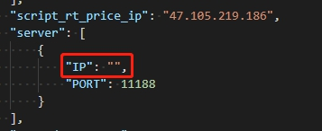
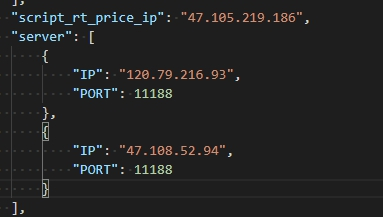
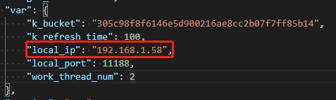

# 节点部署说明

有现成的测试网络公网节点可以使用，如果非必要，可以不用自己部署。

## 一、 节点硬件配置要求

推荐配置：linux系统 四核八G  500G以上硬盘

 

## 二、 程序配置及启动

1. 先解压uenc程序包，在uenc文件夹内

2. 运行uenc程序 

   ./uenc

3. 程序会自动生成配置文件 config.json， 然后ctrl + c退出程序

4. 修改config.json文件

   1. 如果部署的是公网节点，将is_public_node字段改为true；如果部署的是内网节点，则不需要改动；

      ​	 

   2. 对server的IP字段进行修改，增加测试网络公网节点ip地址

       

      改为下图所示：

       

   3. 修改本机IP地址

      1. 如果是部署的是公网节点，需要将local_ip字段修改为本机的公网固定ip地址；

      2. 如果部署的是内网节点，则不需要改动，程序会自动获取本地ip地址。

          

5. 保存并退出config.json文件，用以下命令启动程序：

   ./uenc -fee 1000

   说明：初次启动需要设置燃料费，设置为1000即可，否则该节点无法发起交易，1000 / 1000000 = 0.001uenc 代表燃料费为0.001个uenc，设置成功屏幕会输出 set fee success!

6. 以后直接启动程序即可连入测试网络进行接口对接测试。

   ./uenc

